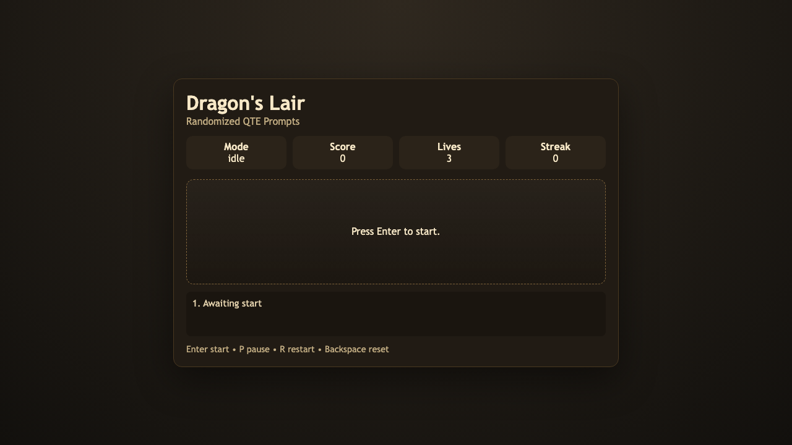

# daily-classic-game-2026-03-27-dragon-s-lair-randomized-qte-prompts

<div align="center">
  <h2>Dragon's Lair: Randomized QTE Prompts</h2>
  <p>React quickly to shifting peril prompts, survive three hits, and chain precise timing for score multipliers.</p>
</div>

## Media
<div align="center">
  
</div>

## Quick Start
```bash
pnpm install
pnpm dev
```

## How To Play
- Press `Enter` to begin from the title screen.
- Match each on-screen prompt before the timer expires.
- Use `P` to pause/resume, `R` to restart run, and `Backspace` to full reset.

## Rules
- A prompt appears at fixed cadence and expects one specific key.
- Wrong key or timeout costs one life and resets streak.
- Run ends when all lives are lost.

## Scoring
- Base success: +100 points.
- Combo bonus: +20 points per current streak level.
- Survive longer to create larger combo chains.

## Twist
- Randomized QTE prompts: each encounter selects from a deterministic seeded prompt pool so every run is reproducible but varied.

## Verification
- `pnpm test`
- `pnpm build`
- `pnpm capture`
- Browser hooks available:
  - `window.advanceTime(ms)`
  - `window.render_game_to_text()`

## Project Layout
- `src/game-core.js`: deterministic state machine and rules
- `src/main.js`: rendering, input plumbing, browser hooks
- `tests/game-core.test.mjs`: rule-level assertions
- `tests/capture.spec.mjs`: Playwright capture and action payloads
- `artifacts/playwright/`: screenshots, payloads, text snapshots, GIF placeholders

## GIF Captures
- Opening Escape Sequence: `artifacts/playwright/clip-opening-escape-sequence.gif`
- Prompt Chain Combo: `artifacts/playwright/clip-prompt-chain-combo.gif`
- Pause Reset Drill: `artifacts/playwright/clip-pause-reset-drill.gif`
